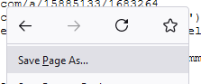
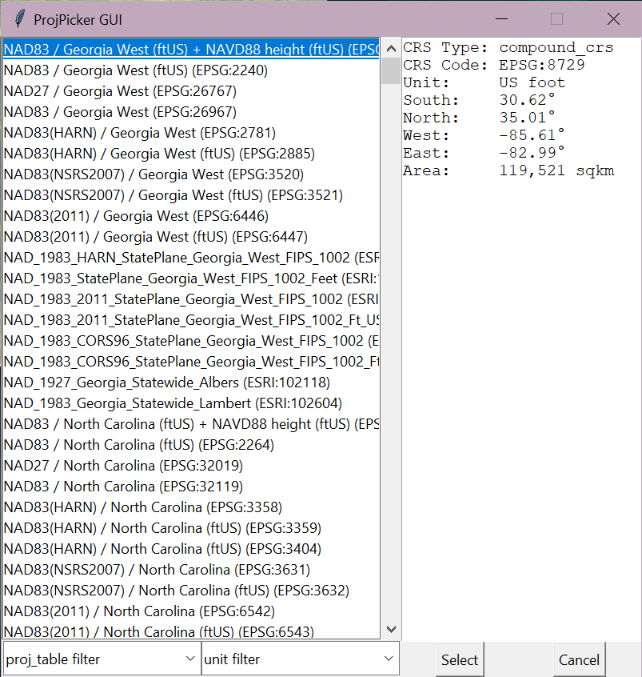
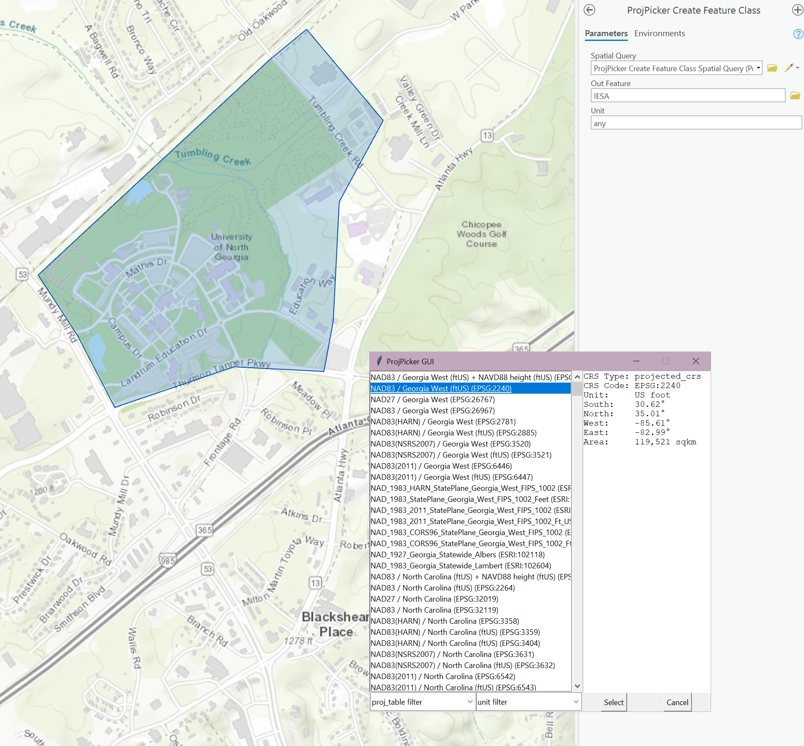
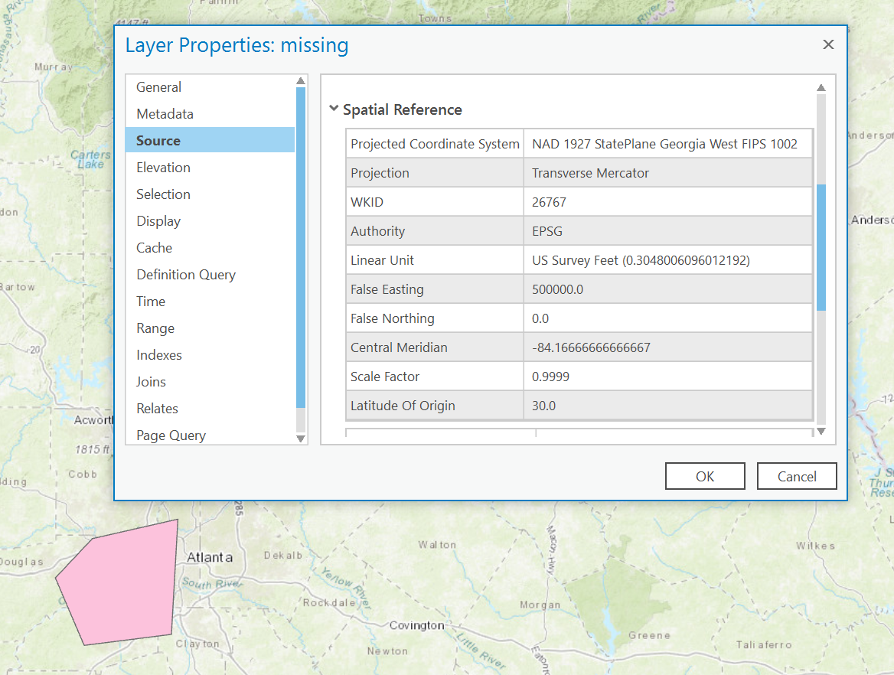
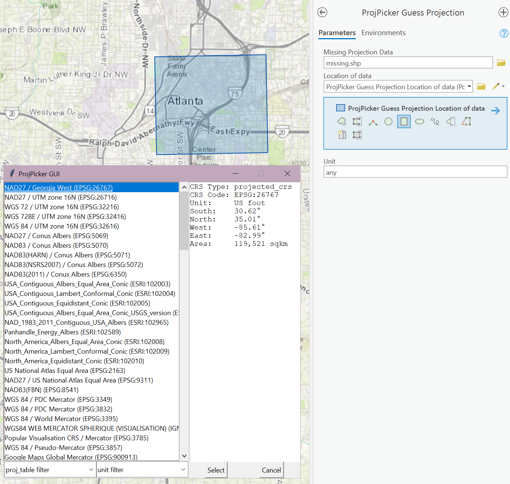
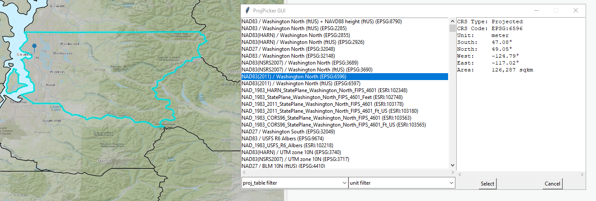
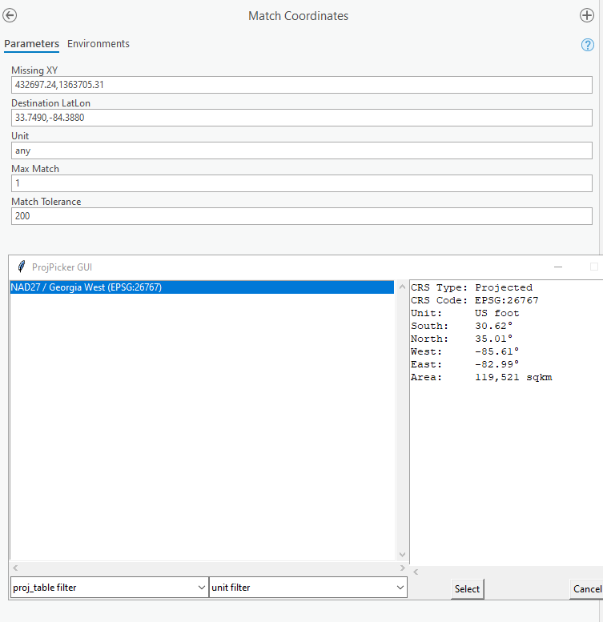

ArcGIS Pro toolbox
==================

Getting started
---------------

Installation
^^^^^^^^^^^^

Installation script: `install.bat <https://raw.githubusercontent.com/HuidaeCho/projpicker/main/guis/arcgispro/install.bat>`_

The ArcGIS Pro toolbox can be installed with the batch script.
The installation script provides a GUI interface that allows the user to install the toolbox and the required Python module in a given folder.
The link to the install script will direct you to the raw file.
Right click on the page when there and click save as to save a local copy of the script.

   Save as install.bat

One can also use curl or Wget to retrieve the install script

Using curl
__________

.. code-block:: bash

   curl https://raw.githubusercontent.com/HuidaeCho/projpicker/main/guis/arcgispro/install.bat -o install.bat

Using Wget
__________

.. code-block:: bash

   wget https://raw.githubusercontent.com/HuidaeCho/projpicker/main/guis/arcgispro/install.bat

Included tools
^^^^^^^^^^^^^^

- ``ProjPicker Create Feature Class``
- ``ProjPicker Guess Feature Class Projection``
- ``ProjPicker Guess Raster Projection``
- ``Match Coordinates``
- ``ProjPicker Reproject Feature Class``
- ``ProjPicker Reproject Raster``

Additional GUI
^^^^^^^^^^^^^^

An additional GUI created with `tkinter <https://docs.python.org/3/library/tkinter.html>`_ and integrated into the ArcGIS Pro toolbox allows the user to sort through and view available projections for their data.

   ProjPicker GUI

Usage examples
--------------

Creating a feature class
^^^^^^^^^^^^^^^^^^^^^^^^

``ProjPicker Create Feature Class`` provides a tool to aid in the creation of new data.
The tool allows the user to draw a spatial query area and get projection recommendations for the feature class.
This functionality is particularly useful when useful when a new project is undertaken and new data must be generated.

   ProjPicker Create Feature Class

ProjPicker will query available CRSs based on the spatial query and sort them to show the most localized projections first.
Additionally, the user is able to sort by unit and projection type to quickly make better decisions for the data.

Correcting shapefiles with missing projection data
^^^^^^^^^^^^^^^^^^^^^^^^^^^^^^^^^^^^^^^^^^^^^^^^^^

With the logical operators detailed in the :doc:`query syntax <query_syntax>`, one can guess the projection information of spatial data that is missing for some reason.
This process can also be seen using the main module API outside of ArcGIS Pro in :doc:`this example </usage_examples/finding_missing_projection>`.
The tool titled ``ProjPicker Guess Projection`` provides this functionality with the tkinter GUI.

Following a similar example as in :doc:`finding missing projection </usage_examples/finding_missing_projection>`, we create data in and around Atlanta, GA in the NAD 27 / Georgia West (EPSG:26767) projection.
The .prj file is then deleted.
When viewed in its new undefined coordinate system, the data is placed in west Africa where the borders of Benin, Nigeria, and Niger touch.

   Created data with original projection

.. figure:: arcgis_pro_missing_projection.png
   :align: center
   :width: 500
   :height: 500
   :alt: Data with projection information missing

   Data with projection information missing

Knowing the data is supposed to be in and around Atlanta, GA, ``ProjPicker Guess Projection`` allows the user to draw either a polygon or point to query the believed "correct" location.
The tool then constructs the :doc:`query syntax <query_syntax>` to use both current location of the data and the believed location to generate a list of possible CRSs.
Again, this generated list will be sorted to show localized projections first.

   ProjPicker GUI output

We can see that ProjPicker is able to guess the projection along with a number of other localized guesses.
With the proper CRS selected, we can press select and the projection information is now defined for the data placing it in the correct spatial location.

Reprojecting a feature class / raster
^^^^^^^^^^^^^^^^^^^^^^^^^^^^^^^^^^^^^

When new projects are undertaken it is integral to choose the most appropriate CRS.
Often when working with new data in the United States, county level boundaries will dictate the region of interest which all analysis will fall in.
The US Census bureau provides :ref:`nation wide county data`_ which can be used to query counties.
However the data is provided in EPSG:4269 which is unsuitable for analysis at a county scales.
ProjPicker can be used to reproject the nationwide data into the proper county level CRS.
Take for instance reprojecting King county, Washington.

The same logic would follow for a raster extracted from a larger dataset to fit more localized analysis.

Matching coordinates
^^^^^^^^^^^^^^^^^^^^

The toolbox also provides ProjPicker's matching capabilities to match XY coordinates of missing data to find what CRS the missing data is in.

Using the example provided at :doc:`Matching coordinates <../usage_examples/matching_coordinates>` we are able to find the missing CRS of data for the Georgia Governer's office.

