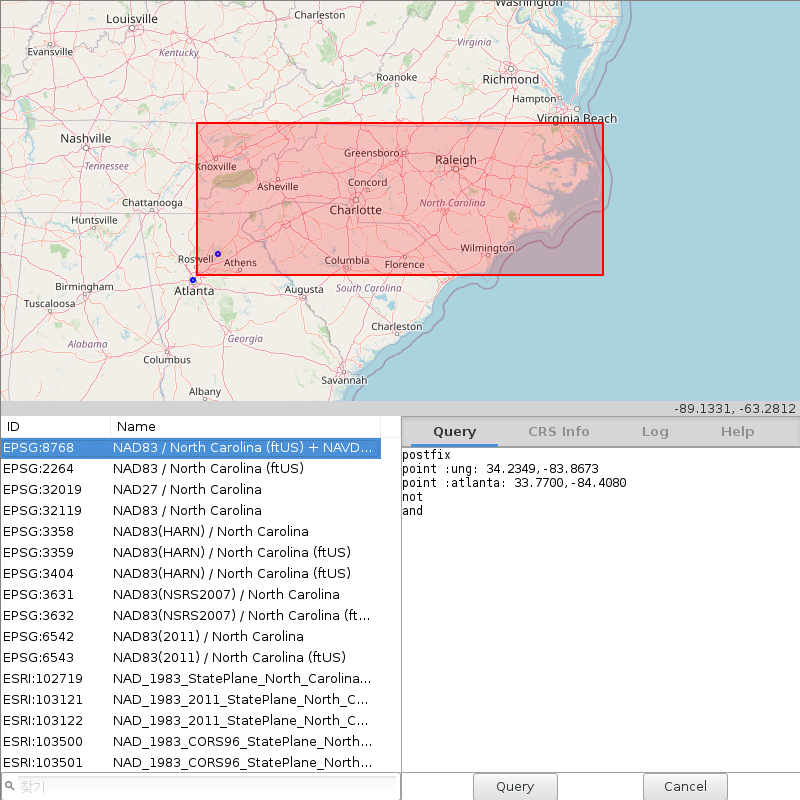

Desktop GUI
===========

ProjPicker provides two GUIs written in `wxPython <https://wxpython.org/>`_ and `tkinter <https://docs.python.org/3/library/tkinter.html>`_.
The wxPython-based GUI looks and feels native on any platform, but the dependency module must be installed using:

.. code-block:: shell

   pip install wxPython

If wxPython is not installed, the GUI falls back to the tkinter-based GUI.
The tkinter module is a part of `the Python standard library <https://docs.python.org/3/library/>`_.

It can be accessed with

.. code-block:: shell

   projpicker -g

and appears on Linux as

   ProjPicker desktop GUI

OpenStreetMap tiling
--------------------

The GUI utilizes `GetOSM <https://github.com/HuidaeCho/getosm>`_ for `OpenStreeMap <https://www.openstreetmap.org/>`_ tile fetching and visualization.
No JavaScript is needed!
While GetOSM was initially created as a part of ProjPicker, it is now an independent package that can be installed from `PyPI <https://pypi.org/project/getosm/>`_.

Geometry drawing
----------------

Geometry can be drawn over the OpenStreetMap tiles and are added to the query builder.
Supported geometries are `point` (points), `poly` (polygons), and `bbox` (bounding boxes).

Query builder
-------------

The ProjPicker GUI helps construct the query syntax with the provided query builder.
It allows for custom queries to be created from drawn geometries in addition to editing and writing one's own queries with ProjPicker's flexible syntax.

Import / export queries
-----------------------

The GUI allows for the import and export of ProjPicker queries saved as a .ppik file.
The file format is a plaintext format and can be edited both within the GUI and through other conventional text editors.
Import or export can be chosen by right clicking on the query builder.

Searching
---------

CRS IDs or any string fields in the CRS info tab can be searched for using the search box below the CRS list.
Multiple words can be searched for by separating them with a semicolon, in which case all the words must be found in any string fields in CRSs.
Search words are case-insensitive.
