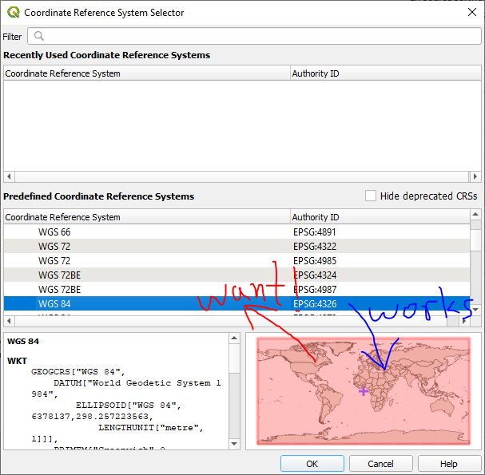

ProjPicker documentation
========================

ProjPicker (Projection Picker) allows the user to select all coordinate reference systems (CRSs) whose extent completely contains given points, polylines, polygons, and bounding boxes.
The goal is to make it easy and visual to select a desired projection by location.
Its web application is available at https://projpicker.pythonanywhere.com/.

   Forward (works) and reverse (want) queries of coordinate reference systems

Sponsor
-------

This project was kindly funded by `the Institute for Environmental and Spatial Analysis <https://ung.edu/institute-environmental-spatial-analysis/>`_ (IESA) at `the University of North Georgia <https://ung.edu/>`_ (UNG).

License
-------

Copyright (C) 2021 `Huidae Cho <https://faculty.ung.edu/hcho/>`_ and `Owen Smith <https://www.gaderian.io/>`_

This program is free software: you can redistribute it and/or modify it under the terms of the GNU General Public License as published by the Free Software Foundation, either version 3 of the License, or (at your option) any later version.

This program is distributed in the hope that it will be useful, but WITHOUT ANY WARRANTY; without even the implied warranty of MERCHANTABILITY or FITNESS FOR A PARTICULAR PURPOSE.
See the GNU General Public License for more details.

You should have received a copy of the GNU General Public License along with this program.
If not, see <https://www.gnu.org/licenses/>.

Table of contents
-----------------

.. toctree::

   getting_started/index

.. toctree::

   usage_examples/index

.. toctree::

   technical_references/index

Indices and tables
------------------

* :ref:`genindex`
* :ref:`modindex`
* :ref:`search`
